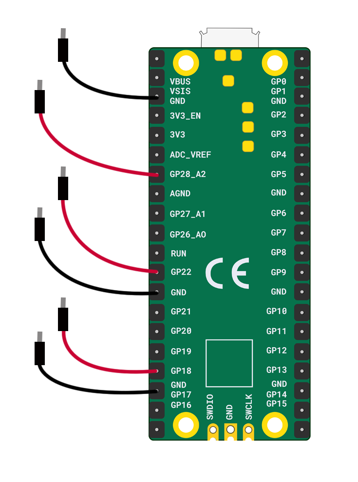

You will need:

+ A Raspberry Pi Pico
+ 2 x pin-socket jumper wires for each crafted switch

**Note:** This diagram shows **six** jumper wires attached to the Raspberry Pi Pico. This is enough for **three** crafted buttons or switches. If you would like a **fourth** switch then you will need to attach it to a **GP** pin and a **GND** on the right hand side.

+ Attach two pin-socket jumper wires to **GP18** and the closest **GND**
+ Attach two pin-socket jumper wires to **GP22** and the closest **GND**
+ Attach two pin-socket jumper wires to **GP28** and the closest **GND**

