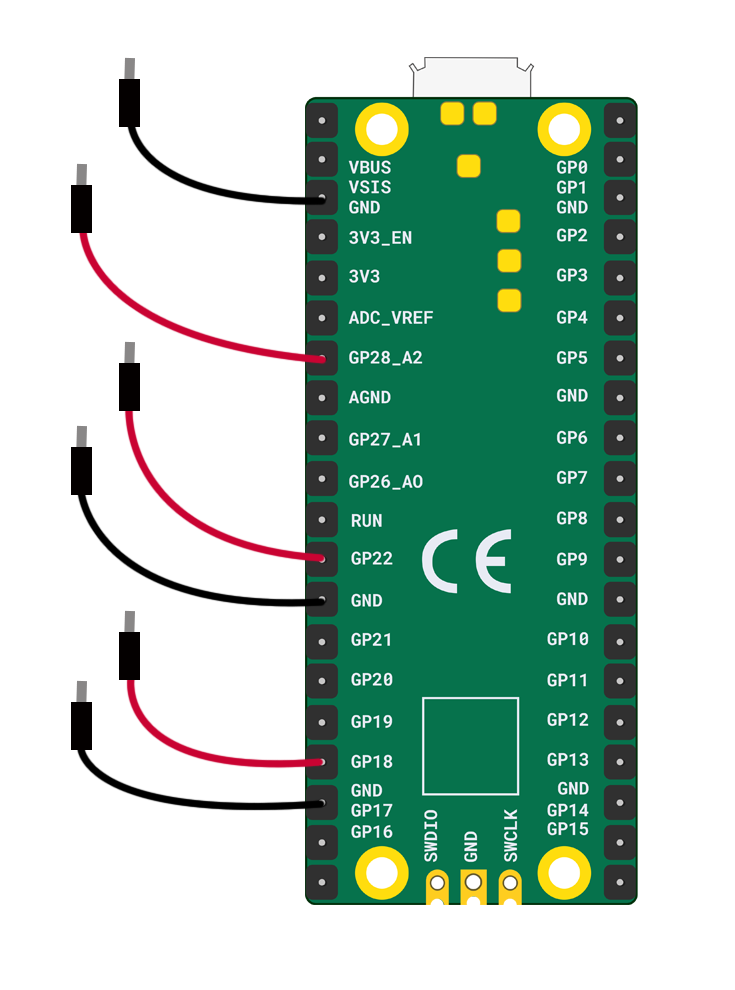

Tu auras besoin de :

+ Un Raspberry Pi Pico
+ 2 fils de liaison broche-prise pour chaque interrupteur artisanal

**Remarque :** Ce schéma montre **six** fils de liaison reliés au Raspberry Pi Pico. C'est suffisant pour **trois** boutons ou interrupteurs artisanaux. Si tu souhaites un **quatrième** commutateur, tu devras le connecter à une broche **GP** et à une broche **GND** sur le côté droit.

+ Fixe deux fils de liaison broche-prise à **GP18** et au **GND** le plus proche
+ Fixe deux fils de liaison broche-prise à **GP22** et au **GND** le plus proche
+ Fixe deux fils de liaison broche-prise à **GP28** et au **GND** le plus proche

